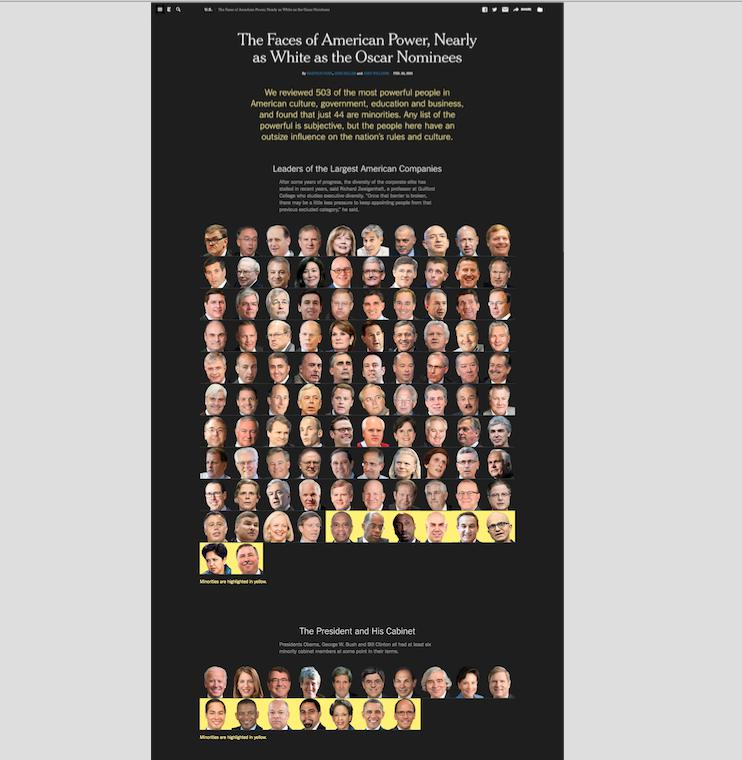
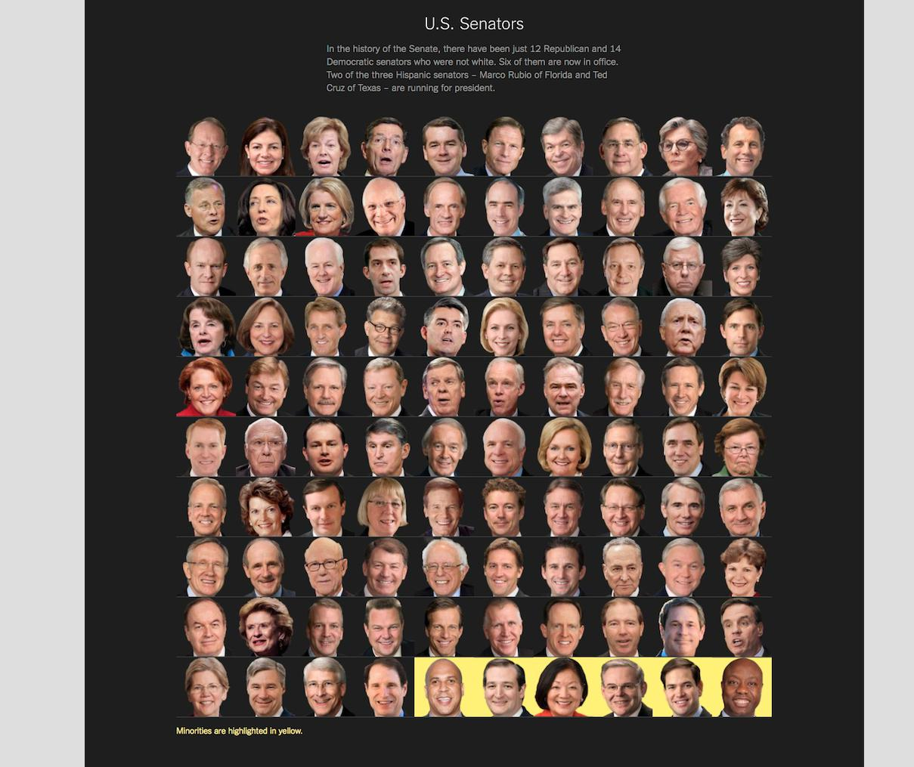

# Metadata/resources for the Congress "Faces of Power" Web Dev example

As inspired by the New York Times interactive data story, [The Faces of American Power, Nearly as White as the Oscar Nominees](https://www.nytimes.com/interactive/2016/02/26/us/race-of-american-power.html)

